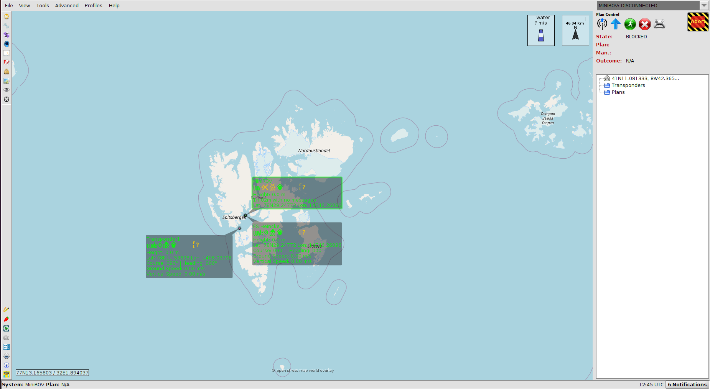

# imc_neptus_ros2 

## Description
Minimal library for bridging ROS2 and IMC messages. In this way, the exchange of information between Neptus and ROS2 is possible. For this project the [imc_ros_bridge](https://github.com/smarc-project/imc_ros_bridge) library as well as the [Neptus](https://github.com/LSTS/neptus) project were used as a model for further development.

## Requirements
- [ROS2](https://docs.ros.org/en/galactic/Installation.html) - Galactic
- Ubuntu 20.04
- [Neptus](https://www.lsts.pt/index.php/software/54/)


## Installation
- Clone the repositories and compile them:
```
$ source /opt/ros/galactic/setup.bash
$ git clone --recurse-submodules https://github.com/paagutie/imc_neptus_ros2.git
$ cd imc_neptus_ros2
$ colcon build
```

### Usage

#### ROS2  
- Different nodes can be run depending on the application. So far there are three different ones; vehicle_node, vessel_node and transponder_node, which can be displayed in [Neptus](https://github.com/LSTS/neptus) simultaneously or independently. Please use the following commands.
```
source install/local_setup.bash
```
- To display the nodes independently use:
```
ros2 run imc_ros2_bridge [node] --ros-args -p bridge_address:='192.168.2.90' -p neptus_address:='192.168.2.90' -p sys_name:='FS Heincke'
```
or
```
ros2 run imc_ros2_bridge [node] --ros-args --params-file ~/imc_neptus_ros2/config/params.yaml 
```

- To display the nodes simultaneously use:
```
ros2 launch imc_ros2_bridge bridge_launch.py params_route:="~/imc_neptus_ros2/config/params.yaml"
```

- To test the robot position, in a new terminal use:
```
$ ros2 topic pub /estimated_state bridge_msgs/msg/EstimatedState "{lat: 0.9269503, lon: 0.154465, phi: 0.087, theta: 0.75, psi: 0.785}"
```

#### Neptus
```
$ cd neptus
$ ./gradlew clean && ./gradlew && ./gradlew run
```

For more information you may visit the [imc_ros_bridge](https://github.com/smarc-project/imc_ros_bridge) and [Neptus](https://github.com/LSTS/neptus) projects. 


## Existing conversions
#### ros_to_imc 
- `std_msgs::msg::Empty on topic /heartbeat -> IMC::Heartbeat`
- `sensor_msgs::msg::NavSatFix on topic /gps_fix -> IMC::GpsFix`
- `geometry_msgs::msg::Pose on topic /goto_input -> IMC::Goto`
- `sensor_msgs::msg::NavSatFix on topic /gps_nav_data -> IMC::GpsNavData`
- `bridge_msgs::msg::RemoteState on topic /remote_state -> IMC::RemoteState`
- `bridge_msgs::msg::EstimatedState on topic /estimated_state -> IMC::EstimatedState`

#### imc_to_ros
- `IMC::Goto -> geometry_msgs::msg::Pose on topic /goto_waypoint`
- `IMC::Abort -> std_msgs::msg::Empty on topic /abort`
- `IMC::Heartbeat -> std_msgs::msg::Empty on topic /imc_heartbeat`
- `IMC::PlanDB -> bridge_msgs::msg::PlanDB on topic /plan_db (JSON)`
- `IMC::Plancontrol -> bridge_msgs::msg::PlanControl on topic /plan_control`

## Neptus visualization

